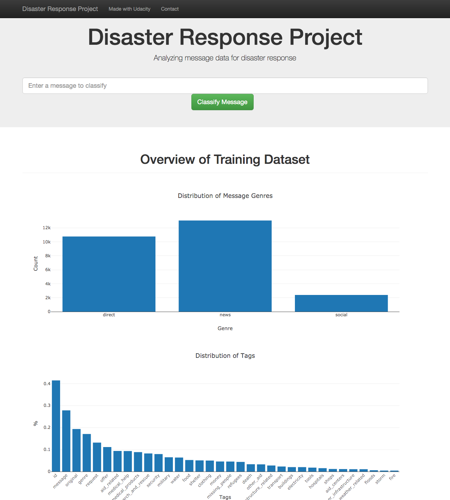
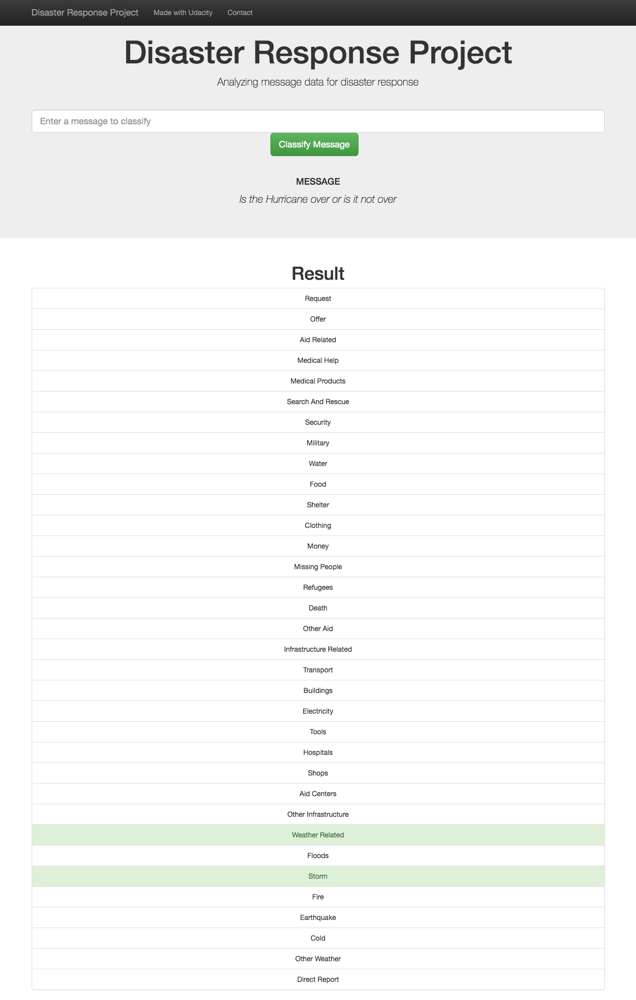

# Disaster Response Pipeline

### Chiyuan Cheng 06/04/2019

## Table of Contents

- [Project Overview](#overview)
  - [ETL Pipeline](#etl_pipeline)
  - [ML Pipeline](#ml_pipeline)
  - [Flask Web App](#flask)
- [Project Description](#run)
  - [Data Processing](#cleaning)
  - [Training Classifier](#training)
  - [Web App](#starting)
- [Conclusion](#conclusion)
- [Files](#files)
- [Software Requirements](#sw)
- [Acknowledgements](#credits)


<a id='overview'></a>

## 1. Project Overview

In this project, I used data engineering skills to: 

-  analyze real natural disaster data from <a href="https://www.figure-eight.com/" target="_blank">Figure Eight</a> , 
-  create ETL and machine learning pipelines that classifying disaster messages sent during a natural disaster, and 
-  create a web app where a relief agent can input a new message and get classification results in several categories in a real time.  

The goal is to direct each emergency message to the appropriate disaster relief agency who can provide immediate assistance.

<a id='etl_pipeline'></a>
### 1.1. ETL Pipeline

ETL pipeline In *data/process_data.py* to:

- Load the `messages` and `categories` dataset
- Merge the two datasets
- Clean the data
- Store it in a **SQLite database**

<a id='ml_pipeline'></a>

### 1.2. ML Pipeline

ML pipeline in *models/train_classifier.py* to:

- Load data from the **SQLite database**
- Split the data into training and testing sets
- Build a text processing and optimized machine learning pipeline
- Train and tunes a model using GridSearchCV
- Output result on the test set
- Export the final model as a pickle file

<a id='flask'></a>

### 1.3. Flask Web App

<a id='eg'></a>

Run [run.py](#com) **from app directory** to start the web app, where users can enter their message queries during a natural disaster, e.g. *"Is the Hurricane over or is it not over"*.

This app will classify the text message into categories, so that appropriate relief agency can be reached out for help.

<a id='run'></a>

## 2. Project Description

Three steps for this project:

<a id='cleaning'></a>

### 3.1. Data Processing (ETL)

Go to the project directory and the run the following command:

```bat
python data/process_data.py data/messages.csv data/categories.csv data/DisasterResponse.db
```

The first two arguments are input data. The third argument is the SQLite Database where the cleaned data is saved. The ETL pipeline is wrote in *process_data.py*.


<a id='training'></a>

### 2.2. Train Classifier (ML)

After the data cleaning process, run the following command from the project directory:

```bat
python model/train_classifier.py data/DisasterResponse.db model/classifier.pkl
```

This will use the cleaned data to train the model, optimize the hyperparameters of the model with grid search and save the model to a pickle file (*classifer.pkl*).


<a id='starting'></a>

### 2.3. Web app

Next, use the Flask web app to predict the classification from the input messages.

Go to the app directory and run the following command:


```bat
python run.py
```

The screen shots of the web app are below:

**_Screenshot 1_**




**_Screenshot 2_**




<a id='files'></a>

## 3. Files

<pre>
.
├── app
│   ├── run.py------------------------# flask file to run app
│   ├── imag_webapp_1		# screenshot of web app
│   ├── imag_webapp_2 		# screenshot of web app
│   └── templates
│       ├── go.html-------------------# classification result page of web app
│       └── master.html---------------# main page of web app
├── data
│   ├── DisasterResponse.db-----------# database to save cleaned data
│   ├── categories.csv-------# raw data to process
│   ├── messages.csv---------# raw data to process
│   └── process_data.py---------------# perform ETL pipline
├── model
│   ├── train_classifier.py-----------# perform classification pipeline
│   └── classifier.pkl		-----------# classifier result
├── notebook
│   ├── ETL Pipeline Preparation.ipynb----------# Jupyter notebook for ETL 
│   └── ML Pipeline Preparation.ipynb-----------# Jupyter notebook for ML

</pre>

<a id='conclusion'></a>
## 4. Conclusion

The dataset used in this project is highly unbalanced, with very few positive examples for some message categories. This results in a low recall despite having high accuracy.

Therefore, more data is needed in order to improve the prediction accuracy and use this app for actual prediction

<a id='sw'></a>

## 5. Software Requirements

The code contained in this repository was written in HTML and Python 3, and requires the following Python packages: json, plotly, pandas, nltk, flask, sklearn, sqlalchemy, sys, numpy, re, pickle, warnings

<a id='credits'></a>

## 6. Acknowledgements

This app was developed as part of the Udacity Data Scientist Nanodegree.